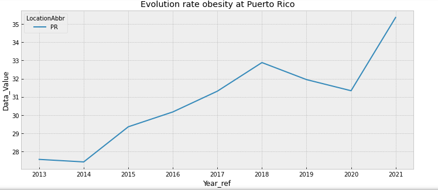
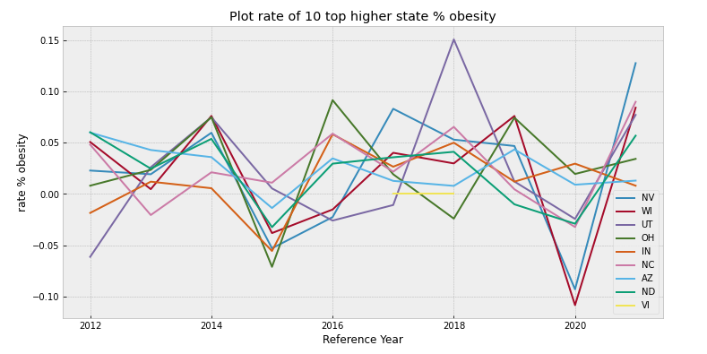
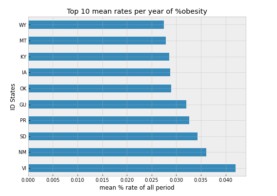

# Exploratory Data Analysis
## About the data:
This dataset includes data on adult's diet, physical activity, and weight status from Behavioral Risk Factor Surveillance System. This data is used for DNPAO's Data, Trends, and Maps database, which provides national and state specific data on obesity, nutrition, physical activity, and breastfeeding.

The original data can be acess on: [Source Data](https://catalog.data.gov/dataset/nutrition-physical-activity-and-obesity-behavioral-risk-factor-surveillance-system)

## Data cleaning and first investigations
The original dataset contains **33 variables** and **88629 registers**.

For variables that have **missing values above 50%** referring to the total numbers of records, they were eliminated. Below are the variables that were disregarded in this analysis.

  

Howerver, the data set was reduced to 24 variables. The relationship between the variable and its description can be found in the data dictionary, present in this link: 

[Data dictionary](https://chronicdata.cdc.gov/Nutrition-Physical-Activity-and-Obesity/Nutrition-Physical-Activity-and-Obesity-Behavioral/hn4x-zwk7)

It was verified that the `YarStart` and `YearEnd` columns in the dataset have the same values, that is, redundant, thay were transformed into only one variable called `Year_ref`.  

  

## Formulating Questions: 
### What are the questions and yours code link? 

  

The records are arranged on 9 classes of questions, they are classified according to the question and location. Where each question carries information about the characteristics of nutrition, physical activity, obesity, etc.

### What are the most frequently questions?  

  

- The most questions frequencies are ***Q036***, ***Q037*** and **Q047**.
    
    `Q036` - *'Percent of adults aged 18 years and older who have obesity'*.
    
    `Q037` - *'Percent of adults aged 18 years and older who have an overweight classification'*.
    
    `Q047` - *'Percent of adults who engage in no leisure-time physical activity'*.
    
- The less frequencies are:
    
    `Q018` - *'Percent of adults who report consuming vegetables less than one time daily'*
    
    `Q019` - *'Percent of adults who report consuming fruit less than one time daily'*
   
### What are the distributions about `Data_Values` for this `QuestionsIDs`? 

  

  
By note the histograms about each questionID, probably data follows a normal distribution curve. To reject the hypothese h0= the distribuition are normal was applied the hypothese test of Shapiro-Wilk for mains questions Q036, Q037, Q046, Q018 e Q019. The results are:

  

### What are the top 10 higher percent of adults aged 18 years and older who have obesity and what is your location by year reference? 

  

Note that the mean value to this group are 58% with obesity of total observation, the standart variation are 1.22%. The max point was in Ohio in 2016 with 60.4%. 

### What are the percent obesity evolution by year and state?

  

Note: All states are in uptrend. 

### What are the correlation between the % of adults with obesity and the % of adults who do not exercise ?
To answer this question, was consider a random sample of the two class with 16000 observations, this is necessary because the two class have diferente size.

  

  
The Pearson Correlation to this case are next to zero. (-0.007184474663715776). Therefore, this data don’t show a correlation with the %non exercise with % obesity. 

### What are the 10 regions that have the highest rates of non-exercise practitioners?

  

 
The higher % of non exercise are with Puerto Rico with 35% in 2021.
#### About years rate evolution obesity Puerto Rico.

  

 
We can observe that 2020 to 2021 have a notable positive increase in the rate of change of % obesity, 12% between this period.

### What are the  growth rate of % obesity by each year_ref ?

  

 

  

 

## Some Conclusions
In summary on the exploratory analysis of these data, we can see that there is no correlation between the state of not exercising and weight gain, which most likely indicates that obesity is not only linked to energy expenditure but also to other factors such as the eating process, routine activities and the biological characteristics of each individual.  
We can see that the data express an increase in the obesity rate over time, in other words the % of obesity in relation to these data indicates an upward trend. The identification of these trends can help in taking public health measures as an attempt to reverse the situation and/or obtain a point of stability.  
Assessing the growth rate is a measure that can indicate the strength of that growth.  
As the possibilities for this work are very vast, this analysis was restricted only to looking at obesity issues with the location and what their growth rates are. This work is not intended to raise plans or indicate suggestions about any social or political system, it is the presentation of some indications that the data brought.

